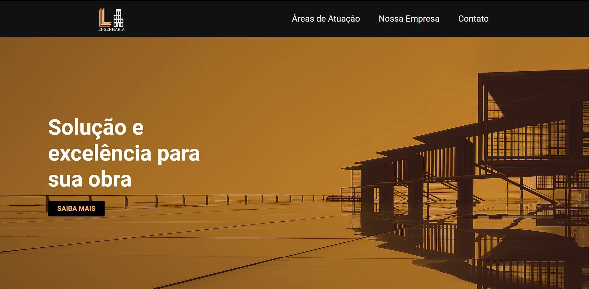

<h1 align="center"> Empresa de engenharia </h1>

Projeto desenvolvido com intuito de aprimorar o aprendizado 

  <a href="#-tecnologias">Tecnologias</a>&nbsp;&nbsp;&nbsp;|&nbsp;&nbsp;&nbsp;
  <a href="#-projeto">Projeto</a>&nbsp;&nbsp;&nbsp;|&nbsp;&nbsp;&nbsp;

 

  

## 🚀 Tecnologias

Esse projeto foi desenvolvido com as seguintes tecnologias:

- HTML e CSS
- JavaScript
- Git e Github
- Figma

## 💻 Projeto

- [Acesse o projeto finalizado, online](https://gabtech1.github.io/Engineering_project/)

---

🏠:wave: